# Smart MCP Proxy — Design Document

## 1 Overview

*Built on **FastMCP v2** for both its internal server runtime and as the client library to upstream MCP endpoints (ensuring dynamic tool registration and spec‑compliant notifications).*

The Smart MCP Proxy is a **federating gateway** that sits between an AI agent and any number of Model Context Protocol (MCP) servers. The proxy:

- **Discovers** tools exposed by upstream MCP servers (HTTP, SSE or stdio).
- **Indexes** their metadata using a configurable embedding backend (BM25, Hugging Face local, or OpenAI).
- **Serves a single control tool `retrieve_tools`.** When the agent calls this tool, the proxy:
  1. Searches the index.
  2. **Automatically registers the top 5 results** with its own FastMCP server instance.
  3. Emits `notifications/tools/list_changed` so connected clients immediately see the new tools, following MCP spec
- Persists tool metadata, SHA‑256 hash and embedding reference in **SQLite + Faiss** for quick reload and change detection.

## 2 Goals & Non‑Goals

|                                   | In Scope    | Out of Scope |
| --------------------------------- | ----------- | ------------ |
| Dynamic discovery of many MCP servers | ✅           |              |
| Hybrid lexical / vector search        | ✅           |              |
| Hot‑reload of proxy without downtime  | 🚫 (future) |              |
| Graph‑based semantic reasoning        | 🚫 (future) |              |

## 3 High‑Level Architecture

```mermaid
graph TD
  subgraph Upstream MCP
    A1[gcore-mcp-server-http-prod]
    A2[gcore-docs]
    A3[gcore-mcp-server-with-oauth]
  end

  subgraph Proxy
    B1(Config Loader) --> B2(Index Builder)
    B2 -->|vectors| B3(Faiss)
    B2 -->|metadata| B4(SQLite)
    B5(FastMCP Server) -. list_changed .-> Agent
    B5 -- calls --> A1 & A2 & A3
  end

  Agent((AI Agent))
  Agent -- retrieve_tool --> B5
  B5 -- new tool wrappers --> Agent
```



## 4 Configuration

### 4.1 Server list (Cursor IDE style)

```json
{
  "mcpServers": {
    "gcore-mcp-server-http-prod":  {"url": "http://localhost:8081/mcp"},
    "gcore-docs":                  {"url": "http://localhost:8000/sse"},
    "gcore-mcp-server-with-oauth": {"url": "http://localhost:8080/mcp"},

    "gcore-mcp-server-prod": {
      "command": "uvx",
      "args": [
        "--from",
        "mcp-gcore-python@git+https://gitlab-ed7.cloud.gc.onl/algis.dumbris/mcp-gcore.git",
        "gcore-mcp-server"
      ],
      "env": {
        "GCORE_TOKEN": "${GCORE_TOKEN}",
        "PORT": "9090"
      }
    }
  }
}
```

### 4.2 Embedding backend via ENV

| Variable         | Allowed values                                | Default |
| ---------------- | --------------------------------------------- | ------- |
| `SP_EMBEDDER`    | `BM25`, `HF`, `OPENAI`                        | `BM25`  |
| `SP_HF_MODEL`    | e.g. `sentence-transformers/all-MiniLM-L6-v2` | —       |
| `OPENAI_API_KEY` | your key                                      | —       |

The proxy chooses the search driver at startup; mixed‑mode hybrid search (lexical + vector) is possible in future.

## 5 SQLite + Faiss Schema

```sql
-- SQLite (file: proxy.db)
CREATE TABLE tools (
  id              INTEGER PRIMARY KEY,
  name            TEXT NOT NULL,
  description     TEXT,
  hash            TEXT NOT NULL,
  server_name     TEXT NOT NULL,
  faiss_vector_id INTEGER UNIQUE
);
CREATE INDEX idx_tools_hash ON tools(hash);
```

- **Vectors** are stored in a side‑car Faiss index (`tools.faiss`). `faiss_vector_id` provides the linkage.
- SHA‑256 hash = `sha256(name||description||params_json)` enables change detection.

## 6 Operational Flow

| Phase            | Action                                                                                                                        |
| ---------------- | ----------------------------------------------------------------------------------------------------------------------------- |
| **Start‑up**     | 1️⃣ Load JSON config → 2️⃣ Fetch `tools/list` from each server → 3️⃣ Insert/Update SQLite rows, embed & upsert Faiss vectors. |
| **User query**   | 4️⃣ Agent calls `retrieve_tool(query)` → 5️⃣ Proxy scores candidates, picks top 5, registers wrappers, fires `list_changed`.  |
| **Invocation**   | 6️⃣ Agent invokes newly appeared tools as normal MCP calls.                                                                   |
| **Refresh loop** | 7️⃣ Proxy polls upstream `notifications/tools/list_changed` (or periodic list) to maintain single source of truth.            |

## 7 Security & Rate‑Limiting

- **OAuth**: servers marked with `oauth=true` in extended config use bearer tokens cached in memory.
- **Per‑origin quotas**: simple token‑bucket keyed by `server_name`.
- **Sandbox**: new wrappers execute via FastMCP’s remote client; no Python eval happens inside the proxy.

## 8 Alternative Designs

| Option                    | Pros                             | Cons                                    |
| ------------------------- | -------------------------------- | --------------------------------------- |
| **Remote pgvector DB**    | Horizontal scale, SQL queries    | Adds external dependency                |
| **Graph RAG (KG + HNSW)** | Captures inter‑tool dependencies | Higher complexity / write‑amplification |

## 9 Open Questions

1. How much weight should synthetic questions (à la TDWA in ScaleMCP) have in embeddings vs. plain BM25?  
2. Should top‑k be adaptive (e.g., score ≥ 0.8) instead of a fixed 5?  
3. Would batching multiple `retrieve_tools` calls per user request, as ScaleMCP does, significantly improve latency?  
